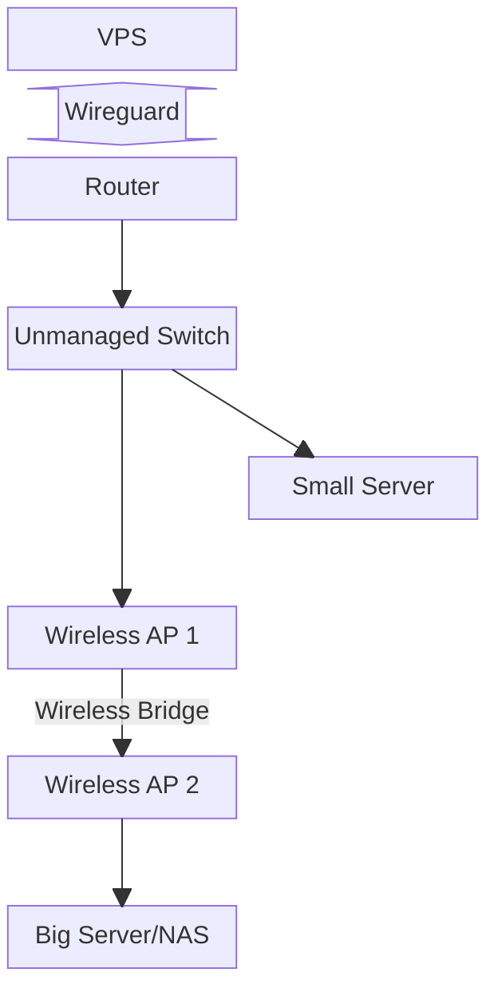

This repo will be an outline of my home lab configuration both the software and physical layout. I'll include links to any open source projects I'm using.

Physical layout:

```mermaid
block-beta
  columns 2
  VPS space 
  blockArrowId6<["Wireguard"]>(y) space
  Router
  space:3
  Router --> Switch_1["Unmanaged Switch"]
  space:4
  Switch_1 --> Server_1["Small Server"]
  space:2
  Switch_1 --> WAP_1["Wireless AP 1"]
  space:3
  WAP_1-- "Wireless Bridge" -->WAP_2["Wireless AP 2"]
  space:3
  WAP_2 --> Server_2["Big Server/NAS"]
```