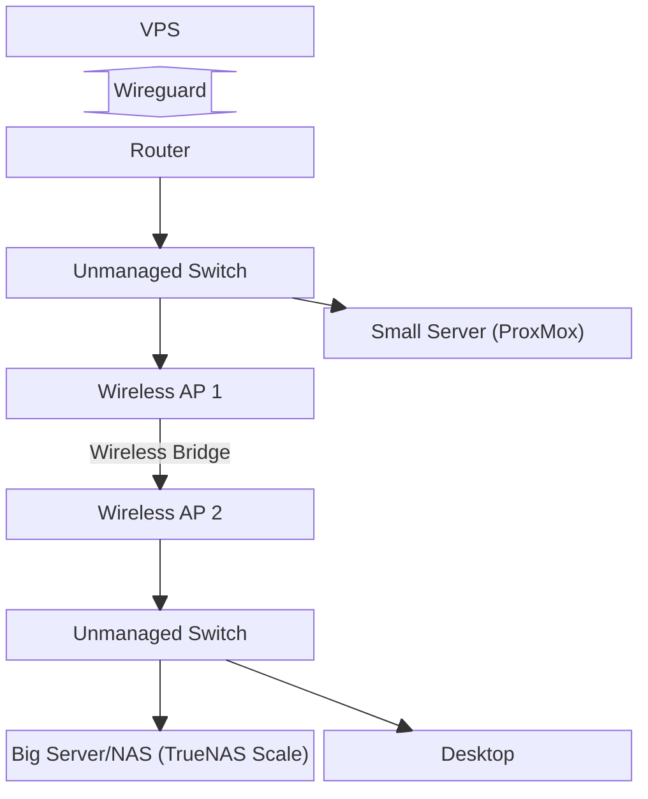

This repo will be an outline of my home lab configuration both the software and physical layout. I'll include links to any open source projects I'm using.

## Physical layout:

## Software Stack running on the Small Server:

Proxmox 8
Ubuntu 24.04 LXC Containers  (I'll add in github/repo/website links later)  
    - Paperless-ngx  
    - Paperless-ai  
    - NTFY.sh  
    - Searxng  
    - Zammad Helpdesk  
    - Zammad Helpdesk (Test environment so I don't break prod)  
    - Invoice Ninja  
    - Vaultwarden  
    - Hoarder.ai  
    - Minecraft Bedrock Server  
    - One LXC for testing purposes. Currently intending to try making a site scraper that uses Puppeteer. I want something that can scrape UPS, Fedex, etc. and just notify me when the page updates via ntfy.sh and currently the projects that do that only use BeautifulSoup or similar and they do not support Javascript rendering.

HomeAssistant OS in a VM  
A VM for SpinRite 6.1 (BIOS emulation)  
    - I use this to test external drives without needing a whole machine for the task.  
    - It does run at a slower pace but the drives I test aren't time sensitive.  

Windows Server 2022 Eval in a VM  
    - I run a small AD using this and it powers the authentication backend for services that directly tie into LDAP/AD authentication.

## Software Stack on the Big Server/NAS:

TrueNas Scale Electric Eel 24.10  
    - Windows Server 2022 for user data that is accesssed via the AD logins. Needed NTFS permissions since Unix permissions get messy when misconfigured. Unix permissions also do not support extended attributes or permission granularity.  
    - Dockge to run Ollama and Open WebUI (Web frontend for accessing Ollama models)  

I also store the bulk of my data here using ZFS in a striped mirror configuration. This allows for redundancy in the event of a drive failure but also increases the pool size so I'm not splitting up the data into separate pools.

## Network Equipment

I run Ubiquiti networking equipment as it's robust enough to handle my use cases while also being easy enough to keep an eye on everything from the dashboard. For those that noticed the wireless bridge, it's in place due to physical constraints that I hope to resolve sometime in the year 2025 by running a CAT6+ run to the switch in that room.
